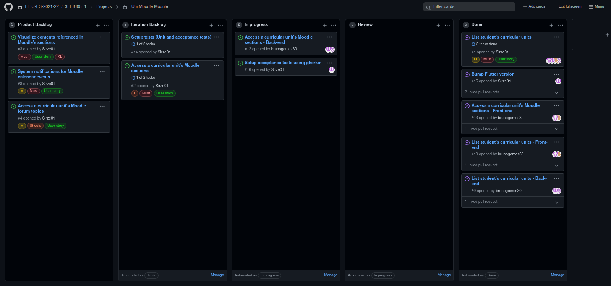

# Iteration 1 retrospective
## Link to the release 

https://github.com/LEIC-ES-2021-22/3LEIC05T1/releases/tag/v1

## Screenshot of the project board

## Retrospective meeting conclusions
### What went well?

- Good use of the git flow, making use of the project board and issue/pull request mechanism

- Good work distribution among all team members

### What should we do differently?

- Be more aware of the worload of the proposed tasks

- Finish the tasks in advance, in order to prepare the iteration presentation and fix possible last minute issues

### What still puzzles us?

- General use of the Flutter framework

- Gherkin acceptance testing step definiton

- Usage of the Moodle API to gather the needed data