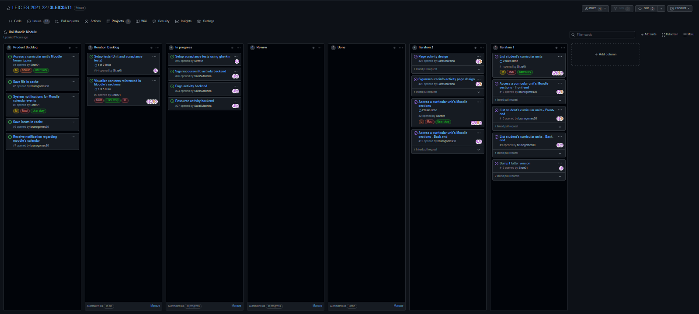

# Iteration 1 retrospective
## Link to the release 

https://github.com/LEIC-ES-2021-22/3LEIC05T1/releases/tag/v2

## Screenshot of the project board

## Retrospective meeting conclusions
### What went well?

- Parallel distribution of work was efficient

### What should we do differently?

- Invest less time in forcing a certain way to achieve the wanted result

- Finish the tasks in advance, in order to prepare the iteration presentation and fix possible last minute issues

### What still puzzles us?

- The hardships of getting the Moodle authentication figured out using either sigarra or federated authentication not knowing how the Moodle REST API works, only to find out when web scrapping was already implemented (scrapping was the chosen method)