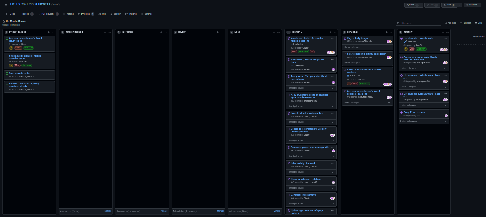

# Iteration 2 retrospective
## Link to the release 

https://github.com/LEIC-ES-2021-22/3LEIC05T1/releases/tag/v3

## Screenshot of the project board

## Retrospective meeting conclusions
### What went well?

- Parallel distribution of work was efficient
- Rate of development

### What should we do differently?

- Nothing

### What still puzzles us?

- Insuficient time to dedicate to this project
- The lacking Dbms implementation in the sqflite package
- Dearth of flutter widgets generated from html code