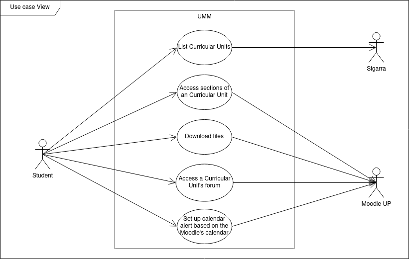

## Requirements

### Use Case Model

|||
| --- | --- |
| *Name* | List Curricular Units |
| *Actor* |  Student | 
| *Description* | The student accesses the list of current curricular units provided by Sigarra |
| *Preconditions* | - The student must be authenticated in UNI |
| *Postconditions* | - The student is in the curricular units page |
| *Normal flow* | 1. The student accesses the uni app.  2. The student selects the "Unidades Curriculares" menu option.   3. The list of curricular units is shown; if the student isn't registered in any curricular unit the message "Não está inscrito em qualquer UC" should be displayed. |
| *Alternative flows and exceptions* | 1. [No Internet Connection] If no Internet connecion is available and there's no cached curricular units list, an alert is displayed. |

|||
| --- | --- |
| *Name* | Access Sections of a Curricular Unit |
| *Actor* |  Student | 
| *Description* | The student accesses the Moodle's sections of the selected curricular unit. |
| *Preconditions* | - The student must be authenticated in UNI   - The student must be in the curricular units page. |
| *Postconditions* | - The student sees the curricular units sections including description, links and documents. |
| *Normal flow* | 1. The student selects the curricular unit.   2. The student selects the "Moodle" option.   3. The sections of the selected curricular unit are shown. |
| *Alternative flows and exceptions* | 1. [Moodle page not available] If the curricular unit does not have a Moodle page, in step 2 of the normal flow the "Moodle" option is not available. |

|||
| --- | --- |
| *Name* | Download Files |
| *Actor* | Student | 
| *Description* | The student downloads a file available in Moodle |
| *Preconditions* | - The student is in a Moodle section. |
| *Postconditions* | - The selected file is stored locally for later use without the need to download. |
| *Normal flow* | 1. The student clicks on the file.   2. The system prompts the user to choose how to open the file. |
| *Alternative flows and exceptions* | 1. [No Internet Connection] If there is no Internet connection nor the file is already stored locally, in step 2 of the normal flow an alert message is shown. |

|||
| --- | --- |
| *Name* | Access Curricular Units Forum |
| *Actor* |  Student | 
| *Description* | The student accesses the selected curricular unit forum. |
| *Preconditions* | - The student is in the curricular unit Moodle page. |
| *Postconditions* | - The student sees the curricular unit forum. |
| *Normal flow* | 1. The student selects the Moodle forum option.  2. The student sees the curricular unit's forum.  3. The student selects a forum thread.  4. The student sees the thread messages. |
| *Alternative flows and exceptions* | 1. [No Internet Connection] If no Internet connection is available, the option in step 1 of the normal flow isn't available. |

|||
| --- | --- |
| *Name* | Setup calendar alert based on Moodle's Calendar |
| *Actor* |  Student | 
| *Description* | The student is able to receive notifications, if it is of his interest, of Moodle's Events |
| *Preconditions* | - The student has the UNI notifications enabled. |
| *Postconditions* | The student receives notifications concerning future Moodle's events |
| *Normal flow* | 1. The student receives a notification with a defined advance notice which can be stipulated by the user |
| *Alternative flows and exceptions* | DUVIDA |
